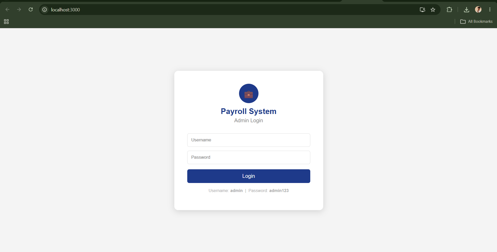
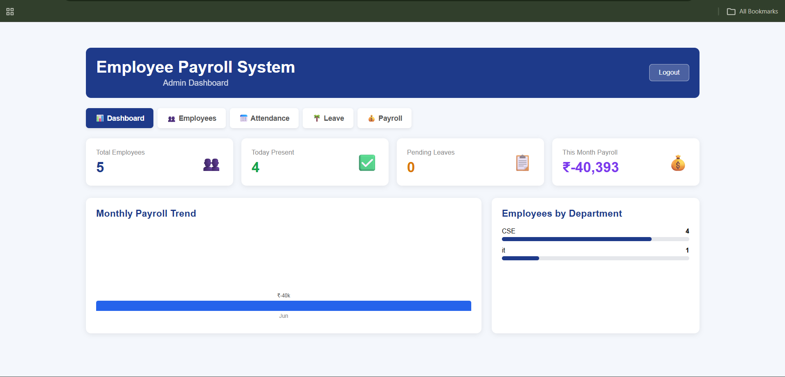
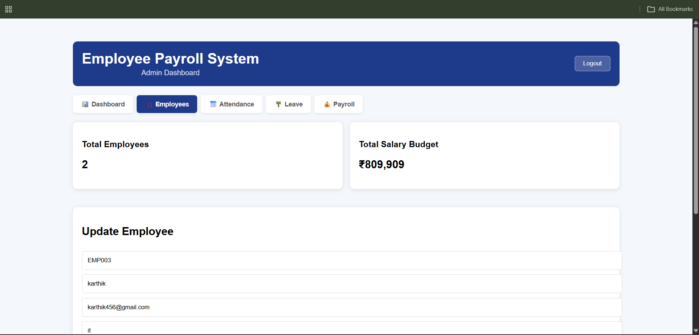
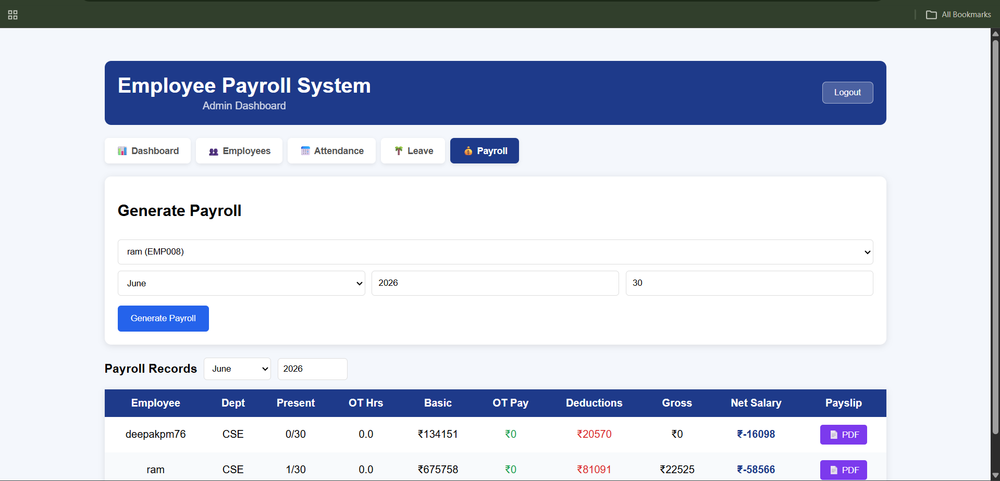
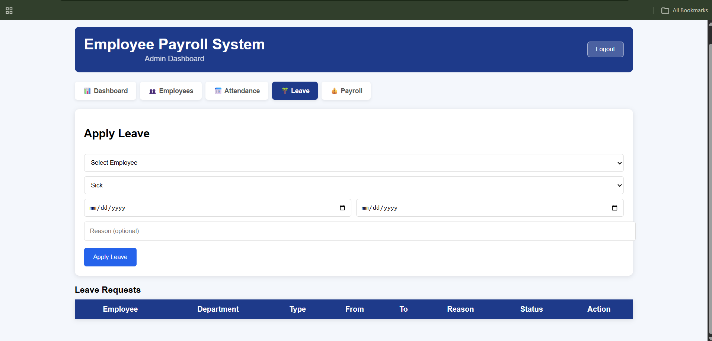
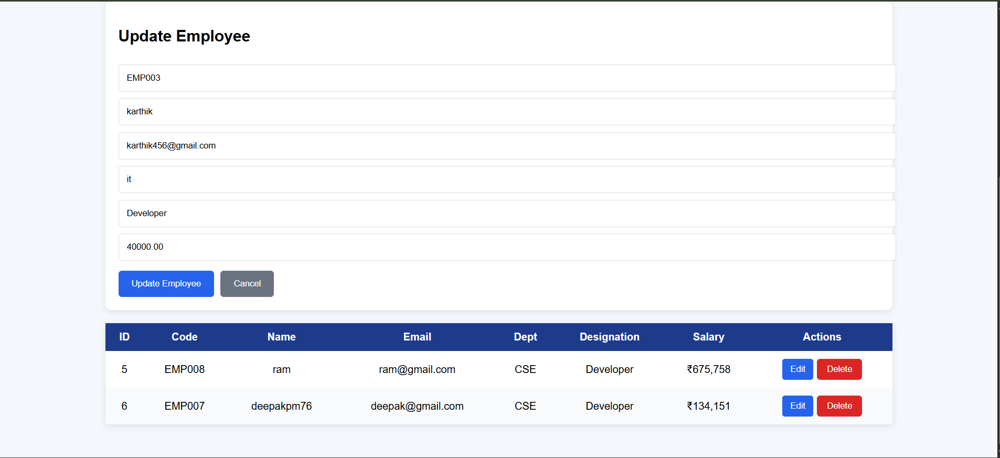
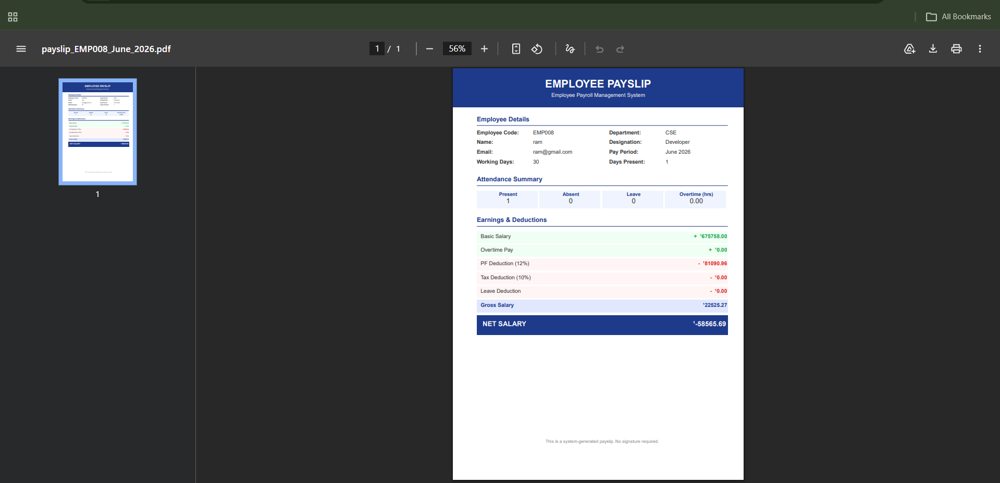
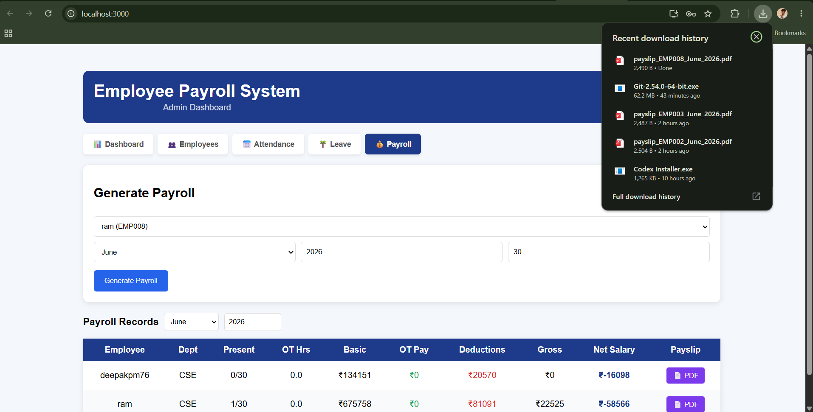

# Employee Payroll Management System

A full-stack payroll management application built with **React.js**, **Node.js**, **Express.js**, and **postgree sql**. The system helps manage employee records, attendance, salary processing, and payroll reports.

##  Features

* Employee Management
* Payroll Processing
* Attendance Tracking
* Salary Reports
* Admin Dashboard
* Secure Authentication

##  Tech Stack

* Frontend: React.js
* Backend: Node.js, Express.js
* Database: postgree sql

##  Installation

### Clone the Repository

```bash
git clone https://github.com/dharanidharan904/employee-payroll-management-system.git
cd employee-payroll-management-system
```

### Install Dependencies

Backend:

```bash
cd backend
npm install
```

Frontend:

```bash
cd frontend
npm install
```

##  Database Setup

1. Create a Postgree sql database.
2. Import the provided `database.sql` file.
3. Update database credentials in the `.env` file.

##  Run the Project

Start Backend:

```bash
cd backend
node server.js
```

Start Frontend:

```bash
cd frontend
npm start
```

Application URL:

```text
http://localhost:3000
```

##  Screenshots of website:

### Login Page



### Dashboard



### Employee Management



### Payroll Management



### Leave appy portal



### Payslip management



### Payslip-copy



### format



##  Developer

Dharanidharan

GitHub: https://github.com/dharanidharan904
